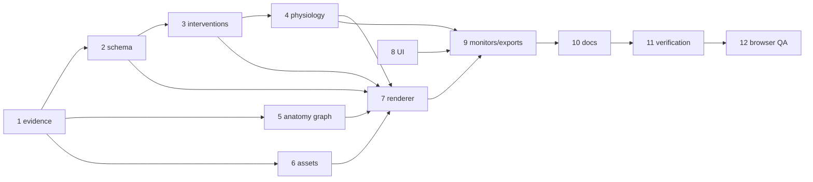

# Phase 5 parallelization scratchpad

Task: `anatomic-multiorgan-icu-simulator.feature.md`

Phase 5 allows at most three simultaneous child agents; the root agent occupies the fourth slot. Permitted native roles are `executor`, `researcher`, `architect`, `test-engineer`, `verifier`, `designer`, `code-reviewer`, and `planner`. The coordinator MUST launch only independent steps in a wave, honor gates, and assign a single owner to each shared file.

Dependencies and gates:

- Step 1 is the evidence release gate. Calibration records and source/license findings gate Steps 3 and 6; contract findings gate Step 2. Source review does not block unrelated UI contract or layout work using placeholders and disabled hypertonic options.
- Step 2 gates Step 4 and validation portions of Steps 7–9. Step 3 gates intervention UI and physiology use of presets. Unreviewed 3%, 7.5%, and 23.4% options remain disabled and cannot mutate state.
- Step 6 gates derived meshes in Steps 5 and 7. Code-owned schematic anatomy and UI work may proceed while provenance is unresolved, but no derivative mesh may ship.
- Step 4 gates metric-dependent monitors and UI assertions. Steps 5 and 6 feed Step 7; Step 8 feeds Step 9; Step 10 follows stabilized terminology; Step 11 gates Step 12.

Parallel waves and ownership:

1. **Wave A (three lanes):** Step 1 (`researcher`/`architect`) owns evidence and calibration documentation. Step 2 (`executor`/`test-engineer`) owns `src/physiology.js` and model tests. Step 8 (`designer`/`executor`) owns UI contract/layout files and UI tests. Steps 1–2 both concern physiology contracts, so edits to `src/physiology.js` are serialized by Step 2; Step 8 proceeds independently with disabled placeholders.
2. **Wave B (after applicable gates, three lanes):** Step 3 (`executor`/`test-engineer`) owns intervention registry and physiology tests. Step 5 (`executor`) owns the anatomy graph and anatomical tests. Step 6 (`researcher`/`executor`) owns manifest, asset README, preparation script, loader, and asset tests. Steps 5–6 have disjoint source ownership; shared manifest or test edits are serialized, with code-owned graph fixtures until provenance passes.
3. **Wave C (after Steps 3–6, three lanes):** Step 7 (`executor`/`designer`) owns `src/anatomy.js` and rendering tests. Step 9 (`executor`) owns `src/monitors.js` and export/model tests. Step 10 (`planner`/`executor`) owns content, physiology docs, and README. Assign shared `src/app.js` and styles integration to Step 7; Step 9 contributes isolated monitor fixtures until integration.
4. **Wave D (serialized):** Step 11 (`verifier`/`test-engineer`) owns verification records and runs tests/check/build after Steps 7–10 merge. Step 12 (`verifier`/`designer`) performs browser evidence and responsive fixes; source fixes return to their owning lane before Step 11 reruns.

Critical path: 1 → 2 → 3 → 4 → 7 → 9 → 10 → 11 → 12, with Steps 5 and 6 joining before Step 7 and Step 8 as an independent contract lane. Acceptance evidence records gate status, owners, changed-file ownership, no overlapping writes, final test commands, and browser checks from Definition Done. Conceptual parallelism never permits concurrent writes to `src/physiology.js`, `src/app.js`, `src/monitors.js`, or a shared test file: each has one named primary owner, while other lanes use review notes or isolated fixtures. The final verifier confirms calibration and provenance gates are represented in runtime state and documentation, while unresolved source review may delay assets without delaying unrelated UI contract work.
