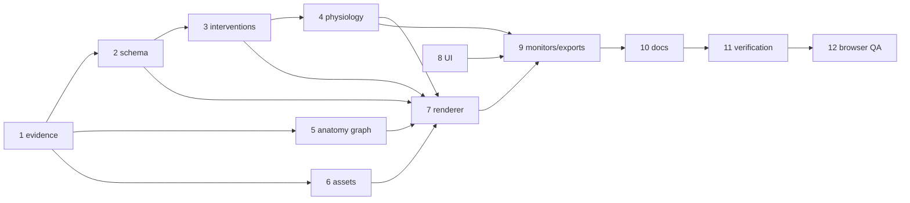

# Improve anatomic accuracy expand multiorgan ICU simulator

## Description

Improve the educational 3D ICU simulator's anatomy and physiology teaching value by making circulation inspectable and modeled responses reproducible. The first release uses one canonical adult baseline scenario. It shows labeled intracranial circulation and schematic tissue beds. Brain, lungs, and kidneys each have an independent see-through control so a learner can follow blood flow into tissue. The kidney view traces urine through a labeled outflow path.

The simulator retains existing norepinephrine and dobutamine controls and their current `µg/kg/min` semantics. It adds explicitly named epinephrine, phenylephrine, and vasopressin presets, plus finite hypertonic-solution concentration presets. These are conceptual simulation inputs with visible units and time basis, never bedside dosing advice. Running the simulation shows cerebral-flow dynamics, a live Frank-Starling curve (the requested “sterling curve”), and a live ventilator view.

The model remains an educational approximation. It must label canonical versus schematic anatomy, disclose units, equations, assumptions, update cadence, and input bounds, and must not provide clinical decision support, patient-specific recommendations, validated predictions, or substitute for medical equipment or care.

Implementation guidance: `.claude/skills/multiorgan-simulation/SKILL.md`.

## Scope

### Included

- Canonical adult intracranial circulation with an approved checklist of bilateral internal carotid, anterior cerebral, anterior communicating, middle cerebral, posterior cerebral, posterior communicating, basilar, and vertebral arteries, plus a labeled venous return/sinus pathway. Circle-of-Willis connections are visibly connected. Capillary beds remain schematic and are labeled as such.
- Independent transparency controls for brain, lungs, and kidneys, with visible schematic flow entering each tissue bed.
- Kidney perfusion view and labeled urine outflow from collecting representation through ureter to bladder outlet, with urine output units.
- Existing norepinephrine and dobutamine controls unchanged; new epinephrine, phenylephrine, and vasopressin presets.
- Hypertonic solution presets labeled 3%, 7.5%, and 23.4%. Each preset is enabled only after a source-reviewed calibration table defines its conceptual input unit, time basis, bounds, and modeled effect. An uncalibrated preset is disabled and cannot mutate state.
- Deterministic time-stepped cerebral flow, MAP/ICP/CPP and cerebral-flow proxy when modeled, a live Frank-Starling curve, and a volume-controlled ventilator view.
- Ventilator controls: respiratory rate 6–35 `/min`, tidal volume 4–10 `mL/kg PBW`, FiO2 21–100 `%`, and PEEP 0–20 `cmH2O`. PBW means the simulator's predicted-body-weight setting. Pressure-control and other ventilator modes are excluded.
- Pause/resume/reset, validation feedback, documentation, and regression tests for existing interactions and import/export/persistence.

### Excluded

- Patient-specific clinical decision support, treatment recommendations, bedside use, clinical validation claims, and real patient/device/EHR integration.
- High-fidelity patient-specific anatomy or physiology, exhaustive microvasculature, disease-specific validation, ventilator alarms, and additional ventilator modes.
- Arbitrary drug dosing guidance, concentration-specific simulation before calibration, and new third-party dependencies or engine/framework requirements.

## User Scenarios

1. **Primary flow:** From reset, a learner toggles each organ independently, follows labeled blood flow into tissue and renal urine outflow, selects a calibrated intervention or ventilator setting, and observes live labeled outputs while the simulation clock advances.
2. **Teaching flow:** An educator pauses the simulation, explains CPP or the Frank-Starling operating point, changes one valid control, resumes, and compares the resulting time-dependent response.
3. **Error flow:** An unsupported or uncalibrated intervention, invalid direct input, or unsupported ventilator mode is unavailable or rejected with a clear message; the last valid state remains unchanged and no non-finite output appears.

## Acceptance Criteria

### Functional Requirements

- [X] **Canonical intracranial checklist:** The loaded anatomy view contains every required arterial and venous structure listed in Scope, with consistent labels, visible circle-of-Willis connections, and an explicit schematic-capillary label.
- [X] **Independent transparency:** Toggling brain, lungs, or kidneys changes only that organ's transparency and control state; the other two controls and organ states remain unchanged.
- [X] **Tissue perfusion visibility:** A transparent organ displays a labeled, distinguishable flow path entering its schematic tissue bed; zero or near-zero flow remains finite and distinguishable.
- [X] **Renal urine outflow:** The kidney view displays a continuous labeled urine path from collecting representation through ureter to bladder outlet and displays urine output with a unit.
- [X] **Existing vasoactive regression:** Norepinephrine and dobutamine retain existing controls, names, `µg/kg/min` input semantics, and modeled behavior; existing regression checks pass.
- [X] **Finite vasoactive set:** The intervention selector exposes only implemented norepinephrine, dobutamine, epinephrine, phenylephrine, and vasopressin presets; selected preset and conceptual input are visible.
- [X] **Calibrated hypertonic presets:** The selector exposes 3%, 7.5%, and 23.4% only when each has a source-reviewed calibration record defining conceptual unit, time basis, bounds, and effect; otherwise that preset is disabled and cannot change state. No UI text frames input as a clinical dose.
- [X] **Unit consistency:** A quantity uses the same documented unit, conversion, rounding, and precision in controls, overlays, charts, exports, and documentation.
- [X] **Live cerebral flow:** While running, changing MAP, ICP, or a supported intervention updates the cerebral-flow proxy over simulation time and keeps it finite. When MAP and ICP are displayed, CPP equals MAP minus ICP within display rounding.
- [X] **Reproducible response:** Replaying a fixed reset-and-input sequence produces the documented modeled direction and time course for cerebral flow, relevant perfusion, and urine output. Architecture defines solver tolerance before implementation tests are approved.
- [X] **Live Frank-Starling view:** The view displays labeled axes and units, a curve, and the current operating point; a supported change to modeled preload, contractility, afterload, or intervention moves the point according to the documented educational model.
- [X] **Live volume-controlled ventilator:** The view exposes only volume-controlled mode and the bounded controls in Scope; changing one valid control updates settings and pressure, volume, and oxygenation proxies while running.
- [X] **Invalid input behavior:** Sliders clamp to documented bounds on commit. Blank, nonnumeric, NaN, Infinity, out-of-range, conflicting, unsupported, or uncalibrated direct inputs are rejected with an explanatory message and preserve the last valid state.
- [X] **Pause/resume:** Pausing freezes the simulation clock and all modeled outputs; resuming continues from the same state without reset.
- [X] **Reset:** Reset restores documented canonical baseline values, default transparency, no active intervention, default ventilator settings, clock, curves, and outputs.
- [X] **State robustness:** Rapid transparency/view toggles, repeated pause/resume, and reset during an active effect do not throw or desynchronize state.
- [X] **Persistence regression:** Existing interactions, import/export, and supported persisted state remain available; imported/persisted values are validated and cannot silently activate unsupported or uncalibrated options.

### Non-Functional Requirements

- [X] Every new view and intervention visibly identifies the model as an educational approximation and does not present patient-specific advice.
- [X] Every control and output has a text label and unit; flow and state are not conveyed by color alone.
- [X] Dynamic displayed values refresh at least every 250 ms while running and stop changing while paused; live views meet the existing documented target frame rate on the supported baseline browser/device.
- [X] Documentation states the adult baseline, PBW meaning, schematic-capillary boundary, equations/assumptions, simulation clock and update cadence, calibrated input records, bounds, and clinical-use exclusion.
- [X] Verification covers anatomy labels, transparency, renal outflow, interventions, calibration gating, unit consistency, cerebral/ventilator dynamics, Frank-Starling updates, invalid inputs, pause/resume/reset, persistence, and prior functionality.

### Definition of Done

- [X] All acceptance criteria pass with recorded evidence.
- [X] Existing build/check and focused tests pass.
- [X] Documentation and educational boundary are updated.
- [X] Existing norepinephrine/dobutamine and import/export/persistence behavior is verified.
- [X] No new dependency or clinical claim is introduced.

## Architecture Overview

### Solution strategy

Extend the existing dependency-free ES-module application in place. `src/physiology.js` remains the single owner of validated inputs, deterministic time stepping, forward cardiovascular/respiratory/renal calculations, derived metrics, and event history; `src/anatomy.js` remains the native WebGL owner of organ shells, semantic vessel/urine route geometry, particles, labels, and compositing; `src/monitors.js` owns canvas plots; `src/ui.js` owns control metadata; and `src/app.js` is the adapter for DOM events, the animation clock, display state, and session migration. Do not introduce Three.js, React Three Fiber, a physics engine, or a runtime asset/decompression dependency. The model guide and `docs/physiology.md` are the authority for educational assumptions and exclusions.

Use a versioned semantic model state rather than letting renderer geometry or DOM controls become sources of truth. The state contract is `schemaVersion: 2`, `scenarioId`, `timeS`, `patient`, `interventions`, `ventilator`, `visual`, `metrics`, `history`, and `events`. Existing flat v1 fields (`fio2`, `peep`, `respiratoryRate`, `tidalVolume`, `icp`, and current vasoactive keys) are accepted by a migration adapter, validated, and mapped to v2 defaults. Unknown keys, non-finite values, unsupported ventilator modes, and unreviewed hypertonic solutions are rejected while retaining the last valid state.

### State and model contracts

`physiology.js` preserves `createSimulation`, `stepSimulation`, `setIntervention`, `setPatient`, and reset contracts, including existing norepinephrine/dobutamine names and `µg/kg/min` semantics. `stepSimulation(state, elapsedS)` integrates deterministic fixed substeps of `1/30 s`, clamps one call to the existing 60 s safety ceiling, and emits history samples at a shared 1 s simulation cadence. Zero, negative, non-finite, and excessively large elapsed values are safe no-ops or bounded advances. Every output is finite and clamped to its documented educational range.

The v2 intervention contract separates `vasoactive` (`norepinephrine`, `dobutamine`, `epinephrine`, `phenylephrine`, `vasopressin`) from `hypertonicSolution` and `fluid`. Each intervention metadata record contains `id`, display name, conceptual unit, time basis, bounds, effect dimensions, and educational copy. Hypertonic records additionally contain `concentrationPercent`, `calibrationStatus`, `reviewedOn`, `sourceUrls`, and calibration version. The numerical solver may consume a hypertonic record only when `calibrationStatus === 'reviewed'` and required fields are present; otherwise the option is visibly blocked and cannot mutate state. No record is presented as a clinical dose or target.

Keep units distinct: `co` is `L/min`; `brainFlow` is the modeled cerebral proxy in `mL/100 g/min`; `cerebralTerritories.{aca,mca,pca}` use that same cerebral-flow unit and sum to the displayed cerebral proxy within tolerance; `renalFlow` is renal perfusion in `mL/min`; `urineOutput` is a separate bounded collecting-system teaching output in `mL/h`; `cpp`, `map`, and `icp` are `mmHg`; `sv` and `edv` are `mL`; ventilator values retain `/min`, `mL/kg PBW`, `%`, and `cmH2O`. `urineOutput` is never labeled GFR, clearance, or a treatment target, and no artery-to-urine particle route is permitted.

The forward model computes preload, contractility, afterload, stroke volume, cardiac output, venous pressure, and MAP in that order. The Frank-Starling object is generated from this same model: it contains labeled preload/EDV samples, current contractility and afterload, and an operating point whose y-value is modeled `sv`. It is a schematic relationship distinct from the existing pressure–volume loop. Ventilator settings feed minute/alveolar ventilation, gas exchange, PEEP load, and downstream oxygenation/hemodynamic proxies. Then compute ICP effects, `CPP = MAP - ICP`, cerebral autoregulation/flow, regional cerebral split, renal perfusion, a bounded kidney filtering transition, and urine output. The filtering transition is an educational relationship only and is never called GFR or clearance. This ordering prevents a decorative curve or disconnected animation from contradicting `sv`, `co`, `cpp`, or organ metrics.

### Anatomy, assets, and rendering

Keep local GLB organ surfaces and the native WebGL renderer. Replace the hand-authored brain route bundle with a named adult teaching graph whose nodes/edges explicitly identify bilateral internal carotids, ACA, ACom, MCA, PCA, PCom, basilar, vertebral arteries, and labeled dural venous return/sinuses, with ACA/MCA/PCA territory endpoints and schematic-capillary labels. Circle-of-Willis edges must be graph-connected and testable. Arterial, venous, and urine routes are separate semantic collections with separate legends and particle systems; particles illustrate movement and do not claim red-cell conservation or CFD.

Use stable route/node names and normalized transforms in `assets/organs/manifest.json` and any GLB additions. `src/organ-assets.js` continues to reject unsupported extensions/external buffers and validates indices, normals, and bounds before loading. Prefer code-owned route graph data for labeled topology until a source mesh has verified release and license; use GLB for surfaces/internal meshes only when the manifest records source, version, transforms, and attribution. Compare the BodyParts3D release README/license to the exact downloaded archive before distributing derivatives; unresolved provenance blocks the asset release and remains documented as under review.

Replace `visual.transparent` with `visual.opacity.brain`, `visual.opacity.lungs`, and `visual.opacity.kidneys` (each `[0,1]`), preserving the old boolean through migration. `anatomy.js` receives visual state and metrics, filters only the selected organ shell, and draws opaque shells/routes before depth-aware translucent shells/routes with depth writes disabled for the translucent pass. Tissue perfusion overlays and capillary labels remain visible at low flow, with text/shape/legend cues in addition to color. The renal collecting-system group runs through calyces/renal pelvis, ureter, bladder, and outlet; it never reuses the blood route group.

### Clock, persistence, and verification boundaries

`app.js` supplies elapsed wall time only while running; dialogs and pause set elapsed input to zero. The fixed-step accumulator, renderer animation phase, monitor history, and displayed values use the same simulation clock. UI refresh is throttled to at most 250 ms while running and never advances state while paused. Reset restores canonical scenario values, v2 visual defaults, no active intervention, default volume-control settings, empty curves/history, and `timeS = 0`.

The v2 JSON export includes schema version, validated settings, visual opacity, calibration IDs/status/version, metrics, and history. CSV adds explicit unit-bearing columns for cerebral regional flow, renal perfusion, urine output, ventilator proxies, and Frank-Starling operating values. Imports migrate v1 flat fields, apply v2 defaults, then use the same validation/gating path as direct controls; imported uncalibrated options are cleared or rejected with a visible message. Tests assert identity tolerances (`1e-6` for exact algebraic identities), finite outputs, deterministic replay, directional response with documented margins, opacity isolation, graph connectivity/labels, asset validation, calibration blocking, and v1 migration. Browser verification remains necessary for WebGL depth/compositing and desktop/narrow layouts. All surfaced results carry the educational-approximation boundary; no clinical validation is implied.
## Phase 4 decomposition

This decomposition follows the [multiorgan simulation skill](../../../.claude/skills/multiorgan-simulation/SKILL.md), the [codebase impact analysis](../../analysis/analysis-anatomic-multiorgan.md), and [Judge 3 architecture synthesis](../../analysis/judge-3.md). Ownership stays within the existing dependency-free ES modules. Work proceeds setup -> foundation -> features -> polish; no implementation may enable a hypertonic preset or ship a derived anatomy asset before its evidence gate is complete.

| Step | Owner/files | Goal and output | Success criteria / blockers / risk | Size |
|---|---|---|---|---|
| 1. Evidence and release gates [DONE] | `docs/physiology.md`, `src/content.js`, `assets/organs/README.md`, `assets/organs/manifest.json` | Record research links, approximation boundary, calibration-record shape, and exact BodyParts3D archive README/license comparison. | Sources are direct and dated; hypertonic records remain disabled until reviewed metadata exists; asset provenance is either verified or explicitly blocks derivatives. Blockers: unavailable source archive or unresolved license. Risk: accidental clinical or license claim. | M |
| 2. Schema and validation foundation [DONE] | `src/physiology.js`, `tests/model-consistency.test.js` | Introduce v2 state, units/bounds, migration from flat v1, finite-output guards, fixed `1/30 s` stepping and `60 s` call ceiling. | Lifecycle contracts preserve existing identities and reject unknown/non-finite/unsupported values while retaining last valid state. Risk: persistence and old controls drift. | L |
| 3. Calibration and intervention registry [DONE] | `src/physiology.js`, `src/ui.js`, `tests/physiology.test.js` | Add named vasoactive presets and metadata contracts; add gated 3%, 7.5%, 23.4% records with conceptual units, time basis, bounds, effect dimensions, review/source/version fields. | Only implemented agents appear; norepinephrine/dobutamine retain `µg/kg/min`; unreviewed hypertonic state cannot mutate. Blocker: Step 1 review. Risk: dose-like copy or unsupported effects. | M |
| 4. Coupled physiology outputs [DONE] | `src/physiology.js`, `tests/physiology.test.js`, `tests/model-consistency.test.js` | Implement deterministic cardiovascular, ventilator, ICP/CPP/cerebral territories, renal perfusion, bounded collecting-system urine output, and Frank-Starling series from one ordered forward model. | `CPP = MAP - ICP` within `1e-6`; finite bounded outputs; deterministic replay and directional margins; urine is `mL/h`, never GFR/clearance. Risk: disconnected metrics. | XL |
| 5. Named anatomy graph [DONE] | `src/anatomy.js`, `tests/anatomical-bundle.test.js` | Define stable graph nodes/edges for bilateral ICA, ACA/ACom, MCA, PCA/PCom, basilar, vertebral, venous sinuses/return, territories, and schematic capillary beds; keep blood and urine collections separate. | Connectivity and required labels are machine-testable; low/zero flow remains visible; schematic boundary is explicit. Blocker: source/asset gate for new mesh. | L |
| 6. Asset pipeline and provenance [DONE] | `assets/organs/manifest.json`, `assets/organs/README.md`, `scripts/prepare-organs.js`, `src/organ-assets.js`, `tests/organ-assets.test.js` | Add only justified internal meshes/routes, stable names/transforms/materials, and manifest attribution; preserve narrow GLB validation. | Bad extensions/external buffers/indices/normals/bounds/transforms fail tests; exact source/license record precedes distribution. Risk: GPU/performance and provenance failure. | M |
| 7. Per-organ rendering [DONE] | `src/anatomy.js`, `tests/anatomical-bundle.test.js` | Replace global transparency with migrated `visual.opacity.brain/lungs/kidneys`; add tissue overlays, labels, renal collecting/ureter/outlet route, and deliberate opaque/translucent depth passes. | Each organ isolates its own shell/routes; routes remain coherent at low flow; urine never reuses blood particles. Risk: WebGL compositing and draw calls. | L |
| 8. UI and app adapter [DONE] | `src/ui.js`, `src/app.js`, `src/styles.css`, `tests/physiology.test.js` | Wire controls, validation feedback, readouts, pause/resume/reset, clock, interventions, transparency, cerebral/renal/Frank-Starling/ventilator views. | Only volume-control mode and specified bounds appear; invalid input preserves last valid state; refresh <=250 ms running and frozen while paused; rapid toggles/reset safe. | L |
| 9. Monitors and exports [DONE] | `src/monitors.js`, `src/app.js`, `src/styles.css`, `tests/model-consistency.test.js` | Add labeled schematic Frank-Starling and live ventilator panels; extend v2 JSON/CSV import/export, migration, calibration status, and unit-bearing columns. | Operating point derives from modeled SV/preload/contractility/afterload; round trips validate state and clear/reject uncalibrated options; no unit drift. | M |
| 10. Educational content and documentation [DONE] | `src/content.js`, `docs/physiology.md`, `README.md` | Explain adult baseline, PBW, equations, cadence, bounds, graph/collecting-system boundaries, calibration records, assumptions, sources, and clinical-use exclusion. | Every control/output has text label/unit and approximation notice; no patient-specific advice, dose target, GFR/clearance, or clinical-validation claim. | M |
| 11. Build and regression verification [DONE] | `scripts/build.js`, `scripts/check.js`, all four existing test files, `docs/verification/*` | Regenerate/validate `dist`, run unit and consistency suites, and record evidence for anatomy, assets, state, persistence, and prior behavior. | `npm test`, `npm run check`, and `npm run build` pass; existing import/export and norepinephrine/dobutamine tests remain green; evidence names commands/files. | M |
| 12. Browser and responsive polish [DONE] | `server.js`, `src/styles.css`, `src/anatomy.js`, `src/app.js`, `docs/verification/README.md` | Verify whole/brain/lung/kidney views at desktop and narrow widths with WebGL depth, labels, live updates, pause, reset, and error flows. | No console/runtime errors; panels and routes legible without color alone; frame/update target met on supported baseline. Remaining risk: device-specific GPU behavior and absent clinical validation. | M |

### Critical path and Definition of Done

Critical path: 1 -> 2 -> 3 -> 4, with 5 and 6 feeding 7, then 8 -> 9 -> 10 -> 11 -> 12. Steps 1 and 6 may leave code-owned schematic routes when provenance is unresolved; they may not silently ship derivative meshes. Definition of Done is the task checklist plus passing `npm test`, `npm run check`, `npm run build`, recorded browser checks, unit-consistent JSON/CSV round trips, deterministic replay evidence, and explicit documentation that the simulator is an educational approximation without clinical validation.
### Phase 5 parallelization

Phase 5 uses at most three simultaneous child agents (the root agent occupies the fourth slot). Available roles are `executor`, `researcher`, `architect`, `test-engineer`, `verifier`, `designer`, `code-reviewer`, and `planner`. The coordinator MUST launch only independent steps in one wave, preserve gates, and keep one owner for each shared file.

Dependencies and gates:

- Step 1 is the evidence gate. Calibration records and source/license findings gate Steps 3 and 6; contract findings gate Step 2. Source review does not block unrelated UI contract or layout work using placeholders and disabled hypertonic options.
- Step 2 gates Step 4 and validation portions of Steps 7–9. Step 3 gates intervention UI and physiology use of presets; unreviewed 3%, 7.5%, and 23.4% options remain disabled and cannot mutate state.
- Step 6 gates derived meshes in Steps 5 and 7. Code-owned schematic anatomy and UI work may proceed while provenance is unresolved, but no derivative mesh may ship.
- Step 4 gates metric-dependent monitors and UI assertions. Steps 5 and 6 feed Step 7; Step 8 feeds Step 9; Step 10 follows stabilized terminology; Step 11 gates Step 12.

Parallel waves and ownership:

1. **Wave A (three lanes):** Step 1, `researcher`/`architect`, owns evidence and calibration documentation; Step 2, `executor`/`test-engineer`, owns `src/physiology.js` and model tests; Step 8, `designer`/`executor`, owns UI contract/layout files and UI tests. Since Steps 1–2 touch physiology contracts, edits to `src/physiology.js` are serialized by Step 2; Step 8 may proceed independently with disabled placeholders.
2. **Wave B (three lanes after applicable gates):** Step 3, `executor`/`test-engineer`, owns intervention registry and physiology tests; Step 5, `executor`, owns the anatomy graph and anatomical tests; Step 6, `researcher`/`executor`, owns manifest, asset README, preparation script, loader, and asset tests. Steps 5–6 have disjoint source ownership; shared manifest or test edits are serialized, with code-owned graph fixtures until provenance passes.
3. **Wave C (three lanes after Steps 3–6):** Step 7, `executor`/`designer`, owns `src/anatomy.js` and rendering tests; Step 9, `executor`, owns `src/monitors.js` and export/model tests; Step 10, `planner`/`executor`, owns content, physiology docs, and README. Assign shared `src/app.js` and styles integration to Step 7; Step 9 contributes isolated monitor fixtures until integration.
4. **Wave D (serialized):** Step 11, `verifier`/`test-engineer`, owns verification records and runs tests/check/build after Steps 7–10 merge. Step 12, `verifier`/`designer`, performs browser evidence and responsive fixes; source fixes return to their owning lane before Step 11 reruns.

Critical path: 1 → 2 → 3 → 4 → 7 → 9 → 10 → 11 → 12, with Steps 5 and 6 joining before Step 7 and Step 8 as an independent contract lane. Acceptance evidence must record gate status, owners, changed-file ownership, no overlapping writes, final test commands, and browser checks from Definition Done.

### Phase 5 ownership correction

Step 2 starts only after Step 1 has handed off its contract findings; it is removed from Wave A's concurrent launch. Step 4 has one concrete owner, `executor`/`test-engineer`, and runs after Step 3's intervention contract, before metric-dependent Steps 7 and 9. The coordinator must serialize the Step 3 → Step 4 physiology handoff and keep Step 4's model-test ownership with that lane.

## Phase 6 verification contract

Verification is an evidence-producing pass over every step, with twelve evaluations (one per step). Each evaluation records commit or artifact identifiers, command output, fixture/source versions, reviewer, date, and pass/fail disposition. Critical panels (Steps 1, 4, 6, 11, and 12) require a weighted score of at least 4.2/5; other steps require at least 4.0/5. A score cannot waive a mandatory source, calibration, or license gate. Rendered browser/device evidence and executable test output take precedence over LLM or reviewer impression; screenshots without a reproducible action or command are insufficient.

The common rubric for every step is: behavioral correctness 0.35, numerical/contract correctness 0.25, safety and educational boundary 0.20, and reproducible artifact evidence 0.20 (weights sum to 1.00). Score each dimension 0–5, retain the four component scores, and report the weighted result. A missing mandatory gate is an automatic fail regardless of score. “High” means panel review with artifact replay; “medium” means one focused test or per-item assertion set plus review; “critical” uses both independent replay and panel sign-off.

| Step | Level | Artifact-specific verification and acceptance evidence |
|---|---|---|
| 1 | Critical | Source ledger, dated calibration records, and exact BodyParts3D archive README/license comparison. Verify every URL resolves to the cited source, calibration status is `reviewed` only with unit/time/bounds/effect/source fields, and unresolved provenance blocks derivatives. |
| 2 | High | Model-contract tests verify v1→v2 migration, unknown-key rejection, finite guards, `1/30 s` fixed stepping, and the 60 s call ceiling. Check unit conversion and volume balance with engineering tolerances recorded in fixtures; no physiologic tolerance is treated as clinical validation. |
| 3 | Medium | Per-intervention registry assertions verify exactly five vasoactive IDs, preserved norepinephrine/dobutamine `µg/kg/min`, visible conceptual unit/time basis, and disabled unreviewed hypertonic presets. Direct and imported uncalibrated selections must leave state byte-equivalent. |
| 4 | Critical | Independent deterministic replays cover cardiovascular, ventilator, cerebral, renal, and Frank-Starling coupling. Assert `CPP = MAP − ICP` to `1e-6`, regional cerebral sum to documented tolerance, shared Frank-Starling SV function/operating marker, VC pressure/flow/volume integral and CO2 coupling. Compare two time steps and record convergence/error; extreme controls produce no NaN/Infinity. Zero elapsed is a no-op; negative/reverse flow is bounded and has documented semantics. |
| 5 | High | Canonical named-topology tests require bilateral ICA, ACA/ACom, MCA, PCA/PCom, basilar, vertebral, venous sinus/return, territories, and schematic-capillary labels, with connected Circle-of-Willis edges. Per-item checks prove blood, venous, and urine collections remain disjoint and low/zero flow remains visible. |
| 6 | Critical | Asset parser tests reject unsupported extensions, external buffers, bad indices/normals/bounds/transforms. Manifest checks stable names, normalized transforms, source/version/attribution, and exact archive-license gate. No derivative mesh is releasable while provenance is unresolved; GPU/performance evidence is attached separately. |
| 7 | High | Per-organ opacity isolation tests prove brain, lung, and kidney changes do not mutate peers. Browser evidence verifies opacity compositing, opaque/translucent ordering, depth behavior, camera matrices for whole/brain/lung/kidney views, and labeled routes at low flow. |
| 8 | High | UI/app tests verify bounded ventilator controls, validation feedback, pause/resume/reset, clock freeze, and rapid-toggle safety. A 250 ms cadence probe confirms displayed values update at least every 250 ms while running and stop while paused. |
| 9 | Medium | JSON v2 and CSV round-trip fixtures verify unit-bearing columns, calibration IDs/status/version, history, and migration. Invalid imports are rejected atomically (state unchanged); valid save v1→v2→import preserves supported values and clears/rejects uncalibrated options. |
| 10 | Medium | Documentation/content scan and per-control review verify adult baseline, PBW meaning, equations, bounds, units, cadence, approximation notice, sources, and clinical-use exclusion. Drug and hypertonic displays must pass concentration/unit/time-source gates and contain no dose target, GFR, or clearance claim. |
| 11 | Critical | Fresh `npm test`, `npm run check`, and `npm run build` output is archived with changed-file and prior-regression evidence. Existing norepinephrine/dobutamine and import/export tests remain green; failures block release until owner-routed fixes rerun the full set. |
| 12 | Critical | Desktop and narrow browser runs cover whole/brain/lung/kidney views, labels, live updates, pause/reset, invalid input, and console/runtime errors. Record real supported device/browser FPS and update cadence, with repeated runs for variance; do not substitute a synthetic benchmark for device evidence. |

Numerical fixtures are engineering targets only: unit conversions and exact identities use `1e-6` where algebra permits; volume balance, integrals, and time-step comparisons use documented fixture tolerances selected and source-reviewed before enabling a feature. Tests must explicitly exercise no-NaN extreme controls, zero flow, reverse-flow semantics, and bounded outputs. Physiologic calibration fixtures require source review before release and cannot be invented from a passing numerical test. Step 4 also gates drug concentration units/time basis, hypertonic calibration source, and Frank-Starling consistency; Step 6 gates asset source/license release. The final report includes twelve evaluation rows, twelve dispositions, four rubric components per row, mandatory-gate status, and links to raw outputs.
